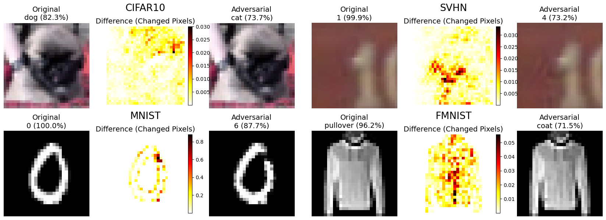
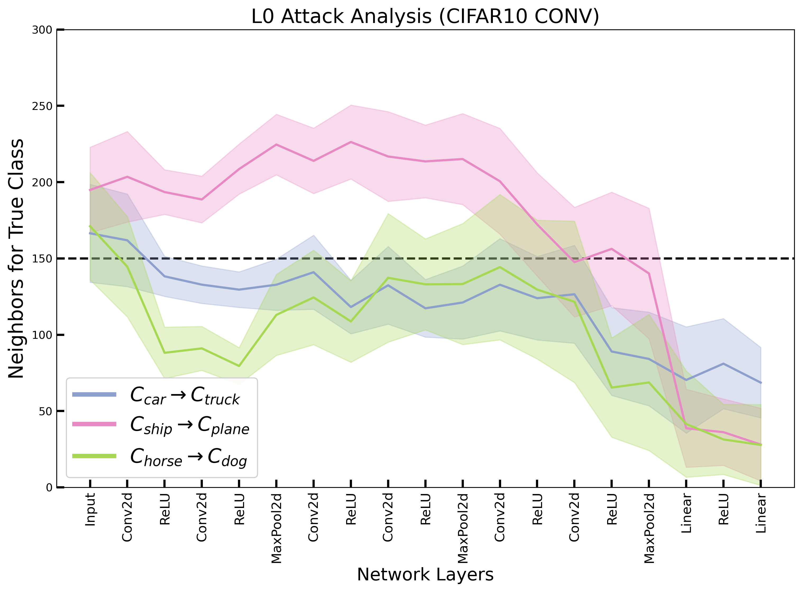
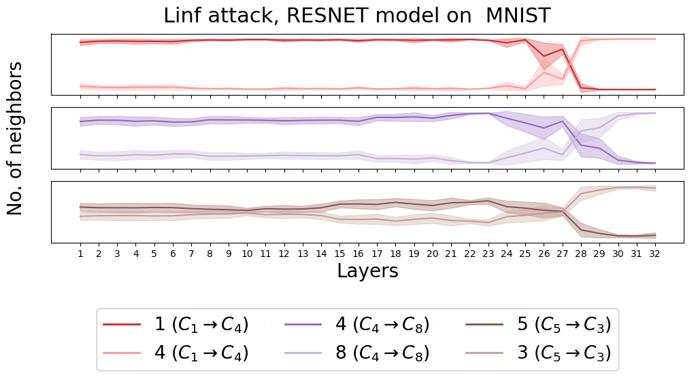

# Adversarial Attack Visualization

This repository focuses on visualizing how adversarial attacks (L0, L1, L2, Linf) affect the internal behavior of trained neural networks using methods such as KNN counting and manifold proximity analysis. It also provides tools for training neural networks (FC, CONV, ResNet) and generating adversarial examples to support these visualizations

For a more detailed explanation of the theory and methodology behind this analysis, see the article:  [Understanding Misclassification Through Manifolds](https://arxiv.org/abs/2204.05764)

## Features

- **Neural Network Training**: Train different types of neural networks including Fully Connected (FC), Convolutional (Conv), and ResNet architectures.
- **Adversarial Attacks**: Implement attacks such as L0, L1, L2, and Linf to evaluate the robustness of trained models.
- **Impact Visualization**: Use KNN counting and manifold proximity methods to visualize how adversarial attacks affect model predictions.

## Requirements

- Python 3.9 - 3.11
- PyTorch (if gpu is avaible use cuda version)
- NumPy
- Matplotlib 
- Pytorch Lighting
- [Adversarial Robustness Toolbox (ART)](https://github.com/Trusted-AI/adversarial-robustness-toolbox)  
- tqdm  
- pickle
- gc

## Installation

Clone the repository to your local machine:
`git clone https://github.com/JanullaPolasko/Adversarial-Attack-visualization.git `

## Theory Behind the Methods

The analysis is based on two complementary techniques that help explain how adversarial examples propagate through a neural network.

The first method examines the nearest neighbors of adversarial examples within the activation space of each layer. By comparing how many of these neighbors belong to the original versus the predicted (incorrect) class, we can observe how the identity of the example shifts as it moves through the network. 

The second method focuses on measuring distances from adversarial examples to class-specific manifolds, which are approximated using convex combinations of nearby training samples. By projecting the adversarial example onto these manifolds, we can determine whether it still lies close to its original class or has moved toward the predicted class. 

##  Usage

To use the repository, begin by editing the `get_dataset_mapping()` function in `network.py`. Here, you need to specify the model's name, its class, and the number of output classes. This function is called across all scripts to automatically locate the necessary components for the given configuration.

Next, either add your own neural network class to `network.py` or select one of the predefined models already available. If your model is pretrained using PyTorch, set the last parameter in `get_dataset_mapping()` to `True`; otherwise, set it to `False`.

### Saving
To control where models, adversarial examples, datasets, and visualization outputs are stored, adjust the paths in `datapath.py`.

###  0. Datasets

The project supports four datasets: SVHN, MNIST, CIFAR-10, and Fashion-MNIST. These are defined in `datasets.py`, where they are loaded, normalized, and prepared for training and evaluation.

###  1. Training

Training is handled by the `train.py` script and is implemented using the PyTorch Lightning library. The script will train model in  `get_dataset_mapping()`, save it into a subfolder named `/network` inside the defined `datapath()`, and plot the training progress using the `compute_dev_plot()` function from `visualization_utils.py`. To improve reliability the training process is repeated five times by default (this can be configured via the `run` parameter), with each model saved under a different identifier.

### 2. Crafting Adversarial Examples

To generate adversarial examples, configure the `run_adversarial_attacks()` function inside the `generate_adversarial.py` script. Here, you can specify the model, dataset, and the type of attack you wish to apply. The attacks are implemented in the `adversarial_utils.py` script. Specifically, L2, L1, and Linf attacks use the Adversarial Robustness Toolbox (ART), while the L0 attack is handled by a custom implementation in the `iterative_pixel_attack()` function.

Once the generation process is complete, the adversarial examples will be saved in the `/adversarials` subfolder, located within the directory defined by `datapath.py`.

At the end of `generate_adversarial.py`, you will find an example of how to call the attack generation function, along with how to visualize the resulting adversarial examples using the `plot_adversarials()` function from `plot_adversarials.py`.

### 3. Visualizing Neural Network Behavior Under Adversarial Attacks

The logic for visualizing how neural networks behave under adversarial attacks is implemented in `proximity_methods.py`, which defines two main analysis methods - `compute_method_ratio()` and `compute_method_projection()`. These methods examine how internal activations evolve across each layer when adversarial inputs are passed through the network.

The analysis begins by loading pre-generated adversarial examples and comparing their internal activations to those of clean training samples, layer by layer. This layerwise tracking helps reveal patterns of sensitivity and feature distortion under attack. In the end the result are also saved under subfolder named `/distanes` inside the defined `datapath()`.

Since these methods require significant memory and computation, the `compute_method_projection()` function uses PCA to reduce the dimensionality. The program currectly support retaining 95% of the variance in the reduction, but this can be adjusted using the variance threshold parameter in the function. The functions also use the parameter `use all`. If set to `False`, only the original and predicted classes are considered, which optimizes memory usage and performance. If set to `True`, the entire dataset is used. Using `use_all=False` can significantly speed up the process and reduce memory consumption, but in some analyses, it might be necessary to include data from all classes.

The visualization process uses various helper functions from `proximity_utils.py`, including tools for KNN counting, activation extraction, and structured comparison. A full example of how to apply these methods can be found in the `save_methods.py`. It contains two functions, `using_projection()` and `using_ratio()`, which demonstrate how to call the analysis pipeline and visualize the results using tools from `visualization_utils.py`. 

<h3>Example of Using KNN Method</h3>

  
  

<h3>Example of Using Proximity to manifolds method</h3>

##  Tips for Usage
- The `generate_adversarial` script may take a long time to run. Make sure your GPU is connected and CUDA is enabled.
- If the proximity methods crash or stop unexpectedly, it's likely due to a memory error. Try reducing the size of the training dataset used for activation extraction to avoid out-of-memory issues (for example this is done in codes for ResNet model) .Additionally, consider setting the use_all parameter to False or lowering the variance threshold in the PCA dimensionality reduction method.

